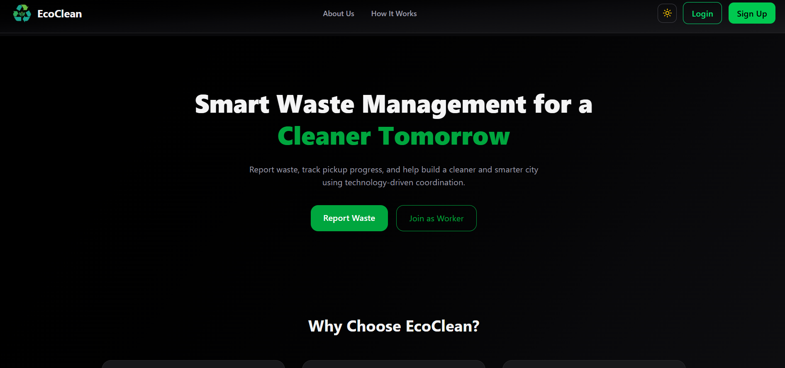
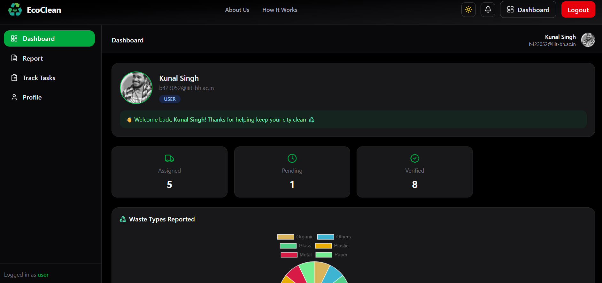
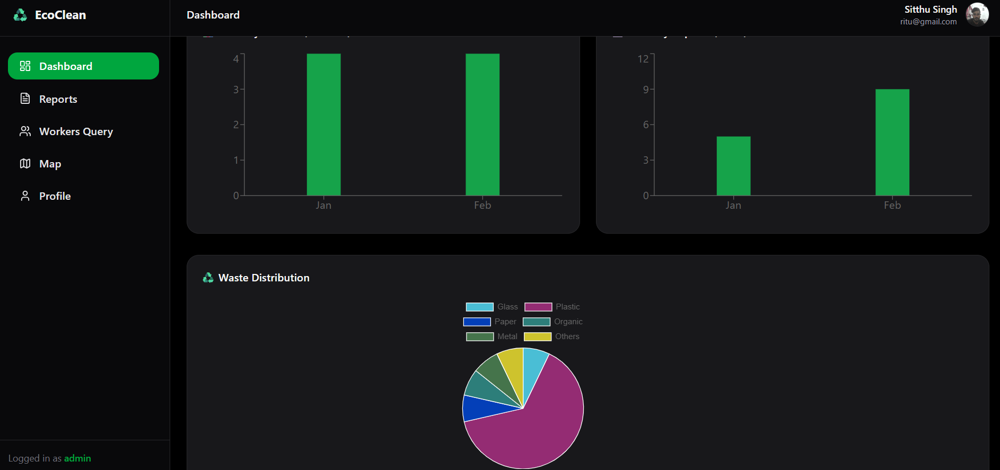
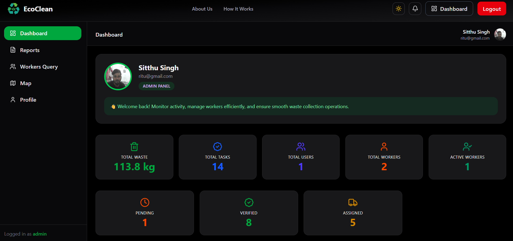
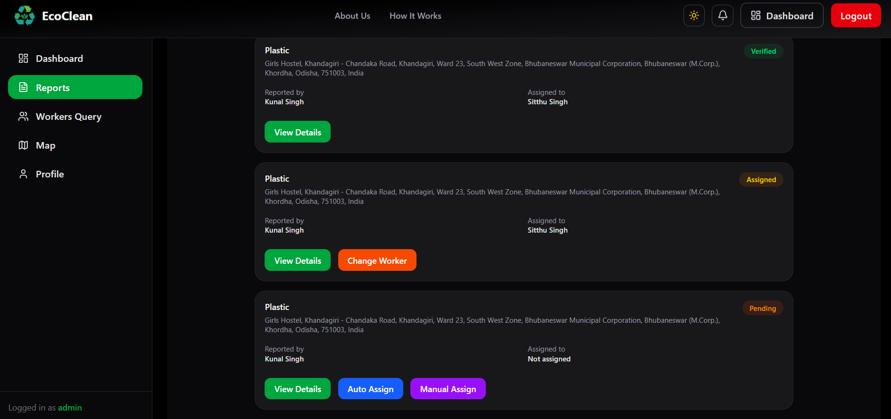
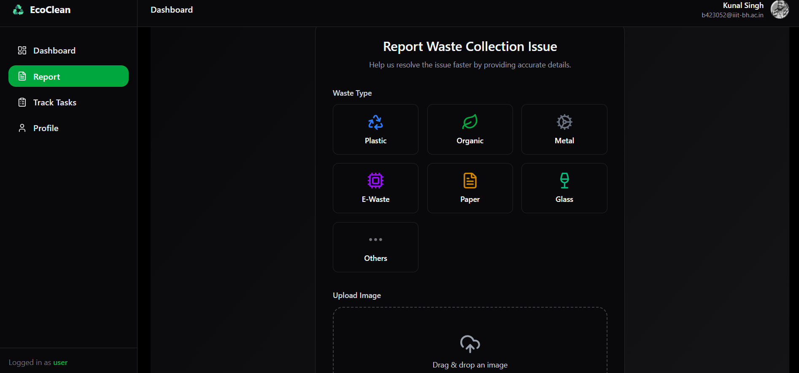
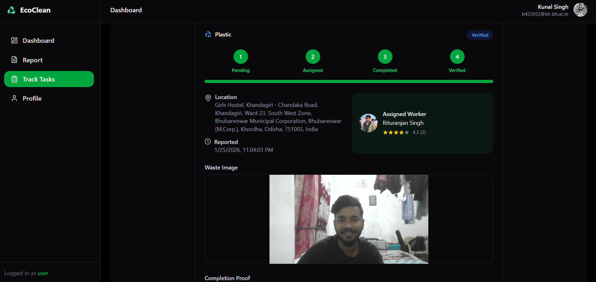

# 🌍 EcoClean – Smart Waste Management System

**A Role-Based Intelligent Waste Pickup & Monitoring Platform**

EcoClean is a full-stack web application built with **Next.js** that streamlines waste reporting, worker assignment, task verification, and administrative monitoring using location-based automation and a structured workflow system.

The platform is designed to bring transparency, accountability, and efficiency to modern waste management operations.

---

## 🚀 Project Overview

EcoClean manages the complete waste pickup lifecycle:

- Users report waste with location and image
- System assigns the nearest available worker automatically
- Workers complete the task and upload proof
- Users verify the completion
- Admin monitors the entire system through dashboards and analytics

The application uses a **single full-stack Next.js architecture**, where frontend and backend APIs are integrated within the same project.

---

## 📸 Application Screenshots

### Home Page

### User Dashboard

### Worker Dashboard

### Admin Dashboard

### Admin Analytics

### All Reports

### Create Waste Report

### Report Status Tracking

## 🧠 Problem Solved

Traditional waste collection systems often face:

- Lack of transparency
- Manual worker assignment
- No real-time tracking
- Poor accountability
- Delayed responses
- No performance insights

EcoClean solves this by providing:

- Location-based automatic worker assignment  
- Role-specific dashboards  
- Proof-based task completion  
- Notification-driven workflow  
- Admin control and override capabilities  
- Monthly analytics and operational insights  

---

## 🏗️ System Workflow

User reports waste  
→ System assigns nearest worker  
→ Worker completes task with proof  
→ User verifies completion  
→ Admin monitors and analyzes system performance  

This creates a structured and accountable workflow for waste collection.

---

## 👥 Role-Based Access

### User
- Create waste pickup requests
- Upload waste images
- Share location automatically
- Track pickup status
- Verify completed tasks
- View personal activity history
- Receive system notifications

---

### Worker
- View assigned tasks
- Toggle availability (Active / Inactive)
- Complete assigned pickups
- Upload completion proof
- Add work details
- Receive assignment notifications
- View monthly performance data

---

### Admin
- View and manage all reports
- Automatic worker assignment based on location
- Manual assignment or reassignment when needed
- Override system decisions
- Monitor task progress across the platform
- View monthly analytics for users and workers
- Analyze complaint distribution through location insights
- Get alerts when no worker is available nearby

---

## 📍 Smart Location-Based Assignment

When a report is created, the system identifies workers within a defined radius and assigns the nearest available worker.  
This ensures:

- Faster response time  
- Reduced travel distance  
- Balanced workload distribution  
- Real-world operational efficiency  

---

## 🔔 Notification System

EcoClean includes a structured notification system that:

- Alerts users, workers, and admins based on workflow events
- Displays unread counts in the interface
- Supports notification history and pagination
- Highlights important system actions such as assignment, completion, or reassignment

---

## 📊 Dashboards & Analytics

### Admin Dashboard
- Monthly verified pickups
- Status-based filtering
- Recent activity overview
- Worker performance monitoring
- Location-based complaint distribution

### Worker Dashboard
- Assigned and completed tasks
- Monthly performance summary

### User Dashboard
- Personal report history
- Pending verification items
- Monthly activity overview

---

## 🎨 User Interface Features

- Fully responsive design (Mobile, Tablet, Desktop)
- Modern dashboard layout
- Dark and Light Mode using **Next Theme**
- Persistent theme preference
- Toast notifications for real-time feedback
- Clean UI with Lucide icons

---

## 🛡 Security & Access Control

- Authentication using NextAuth
- Role-based route protection via middleware
- Separate dashboards for each role
- Protected APIs and session validation
- Restricted access to prevent cross-role actions

---

## 🧱 Tech Stack

### Frontend
- Next.js (App Router)
- React
- Tailwind CSS
- Next Themes (Dark / Light Mode)
- Redux Toolkit
- Lucide Icons
- Sonner (Toast Notifications)

### Backend
- Next.js API Routes
- MongoDB with Mongoose
- Geo-based queries
- Aggregation-based analytics
- Role-based middleware

### Services
- MongoDB Atlas
- Cloudinary (Image Storage)

### Deployment
- Vercel

---

## ⚙️ Setup Instructions

1. Clone the repository  
2. Install dependencies  
3. Configure environment variables  
4. Run the development server  

The application will run locally on the default Next.js development port.

---

## ⭐ Key Highlights

- Full-stack Next.js architecture
- Role-based workflow system
- Geo-based worker assignment
- Auto and manual assignment logic
- Worker availability control
- User verification process
- Notification management
- Monthly analytics and monitoring
- Heatmap-based location insights
- Secure middleware protection
- Dark / Light theme support

---

## 🚀 Why This Project Stands Out

EcoClean demonstrates:

- Real-world system design
- Workflow-driven architecture
- MongoDB geo queries and aggregations
- Role-based access control
- Scalable notification structure
- Admin override and monitoring patterns
- Production-level UI and UX

This is not just a CRUD application — it is a complete operational workflow system.

---

## 🔮 Future Enhancements

- Real-time notifications using WebSockets  
- SMS or email alerts  
- Worker reward and rating system  
- Complaint escalation and resolution module  

---

## 👨‍💻 Author

**Rituranjan Kumar**  
B.Tech IT | Full Stack Developer  

GitHub: https://github.com/rituranjankumar
